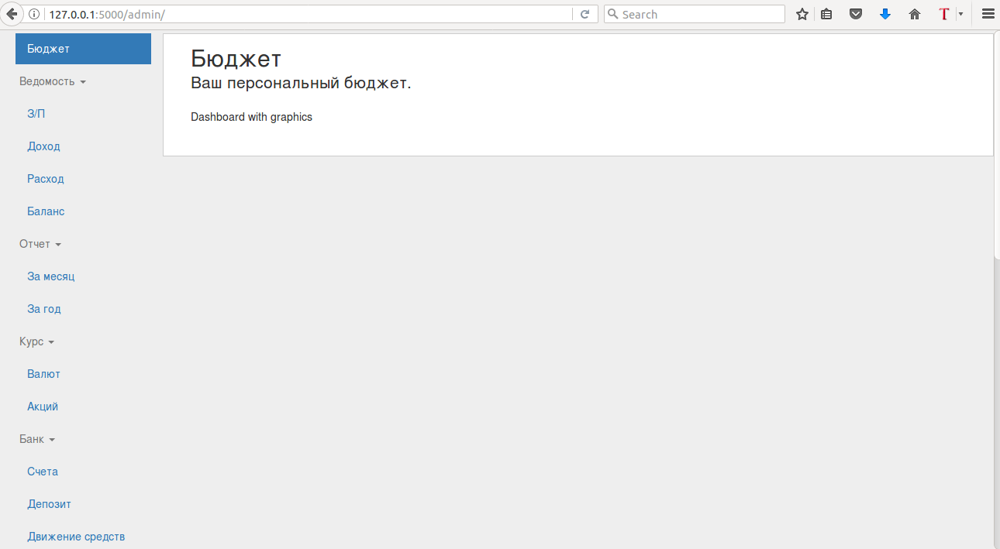

# budgetfamily is the web app for calculate costs

## Flask Admin
 
## Postgres
DB:			budgetfamily_db
USER:		budgetfamily_user
Passwd: 	budgetfamily_passwd

## Create user
sudo -u postgres createuser -D -A -P budgetfamily_user

## Create DB
sudo -u postgres createdb -O budgetfamily_user budgetfamily_db

## Init
make syncdb

## User
make create_superuser

## make

## http://127.0.0.1:5000/admin/
test@gmail.com
test

